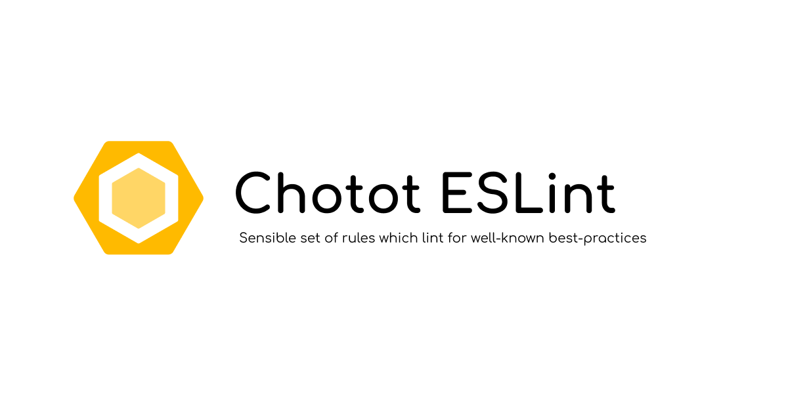

<p align="center">
  
</p>

# @chotot/eslint-config-next

ESLint config for Chotot Next.js applications. Containing roughly 350 rules, including 85 TypeScript rules from @typescript-eslint/eslint-plugin.

## Install

```sh
pnpm add -D @chotot/eslint-config-next
```

## Usage

`.eslintrc.json`

```json
{
	"extends": ["@chotot/next"]
}
```
